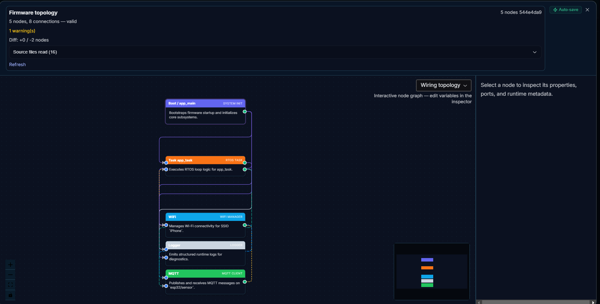
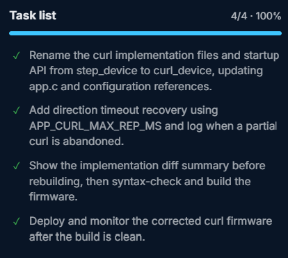

# CURL COACH : a self-calibrating bicep curl rep counter (ESP32-C3 + MPU6050)

Count your reps !

---

## Demo video

[**Watch the demo video**](docs/demo/demo.mp4) (`docs/demo/demo.mp4`, about
63 MB). GitHub does not render an inline video player from a raw HTML
`<video>` tag inside a README, so click through to the file itself. GitHub's
own file viewer plays `.mp4` files natively with full playback controls.

## Chat history

The full FirmGen build conversation, every prompt, plan, and deploy cycle, is
exported at [`imu_bicep_curl_chat_export.html`](./imu_bicep_curl_chat_export.html)
in this directory.

---

## Problem Relevance & Product Value

Wrist-worn rep counters for strength training exist commercially (Blast
Motion, StanceBeam-style bat sensors, and similar), but they're closed
hardware in the $80 to $150 range, built for a single sport, and give you no
visibility into how the detection actually works. Meanwhile, most people
doing bicep curls at home or in a gym have no automatic way to track
reps/sets without manually counting, which is exactly the kind of small,
repetitive cognitive load a $10 sensor should remove.

**Target users:**
- Home/gym lifters who want automatic rep counting without buying a
  proprietary wearable.
- Makers and embedded-systems learners who want a real, working example of
  IMU signal processing (calibration, thresholding, hysteresis, debounce)
  rather than a toy blink-an-LED demo.
- This hackathon's evaluators, as a demonstration of an end-to-end
  sensor to firmware to cloud pipeline built iteratively with FirmGen.

**What it does:** a wrist/forearm-mounted ESP32-C3 + MPU6050 auto-detects
which physical axis your curl motion rotates around, counts reps using
gyroscope direction reversals, shows live status on an onboard RGB LED, and
publishes the running rep count to a ThingSpeak dashboard over Wi-Fi/MQTT
every 15 seconds.

---

## Bill of Materials

| Part | Notes |
|---|---|
| ESP32-C3 development board | RISC-V, Wi-Fi + BLE. Onboard RGB LED (WS2812-style) and BOOT button are used directly; no extra LED/button hardware needed. |
| MPU6050 breakout (accelerometer + gyroscope) | I2C, 3.3V logic. Address `0x68`. |
| 4 female-to-female jumper wires | For the 4 required MPU6050 connections. |
| USB cable | For flashing/power (matches the board's connector, typically USB-C on ESP32-C3 dev boards). |
| Wi-Fi hotspot (phone or router, 2.4 GHz) | ESP32-C3 is 2.4 GHz only. |
| Free ThingSpeak account and channel | For the cloud dashboard (MQTT device credentials, not the channel API key; see `main/app_config.h` comments). |

Everything beyond the dev board is a few dollars in parts: no motors, no
PCB, no soldering required if you're prototyping on jumper wires.

---

## Wiring

| MPU6050 pin | ESP32-C3 pin |
|---|---|
| VCC / 3.3V | 3V3 |
| GND | GND |
| SDA | GPIO4 |
| SCL | GPIO5 |

Onboard RGB LED (GPIO8) and onboard BOOT button (GPIO9) are used as-is; no
wiring required for those two.

> **Voltage note:** use the MPU6050 board's clearly-labeled 3.3V/VCC pin, not
> a `VCC_IN` pin if present; that one is often a regulator input meant for a
> different supply range depending on the specific breakout. Do not connect
> both at the same time.

---

## Build & Flash Instructions

This project was built and is maintained through FirmGen (see
[Effective Use of FirmGen](#effective-use-of-firmgen) below), but it's a
standard ESP-IDF project underneath and builds the same way with the IDF
CLI:

```sh
# One-time: target the correct chip
idf.py set-target esp32c3

# main/app_config.h holds real credentials and is gitignored, so it is not
# in this repo. Create your own copy from the template, then fill it in:
cp main/app_config.example.h main/app_config.h
#   Edit main/app_config.h: APP_WIFI_SSID, APP_WIFI_PASSWORD,
#   APP_MQTT_CLIENT_ID, APP_MQTT_USERNAME, APP_MQTT_PASSWORD,
#   APP_THINGSPEAK_CHANNEL_ID

idf.py build
idf.py -p <YOUR_COM_PORT> flash monitor
```

**First-run calibration (required once):**
1. Power on the device with it mounted the way you intend to wear it
   (wrist/forearm strap, consistent orientation).
2. Press the BOOT button once. The LED turns solid purple, meaning capture
   is recording. Perform one complete, deliberate curl.
3. Press BOOT again to stop capture. The firmware picks whichever gyro axis
   saw the highest peak angular velocity during your motion as the curl
   axis, saves it to flash (NVS), and enables counting.
4. From then on, calibration is remembered across reboots. You only need to
   repeat this if you remount the sensor differently or want to recalibrate
   deliberately (just repeat steps 2 and 3 any time).

**LED status reference:**

| Color / pattern | Meaning |
|---|---|
| Solid green | Wi-Fi and MQTT connected, counting active |
| Solid red | Not connected to Wi-Fi/MQTT (still counts locally) |
| Solid purple | Capture mode: recording a calibration curl |
| Brief cyan flash | A rep was just counted |
| Slow yellow double-blink, repeating | MPU6050 failed to initialize; check wiring |

---

## Functionality & Reliability

- **Rep detection works from raw sensor data to a countable event with four
  independent guards** against noise producing a wrong count: a gyro-rate
  threshold to start a rep, a lower hysteresis release band so noise near
  the threshold doesn't flicker the state, a minimum-time-between-reps
  refractory period, and a maximum-time-in-motion timeout that resets a
  stuck state instead of latching forever.
- **Startup is defensive, not optimistic.** `network_init()` erases and
  retries NVS on a fresh or incompatible partition instead of failing
  silently. If the MPU6050 fails to initialize, the firmware does not go
  dark: it drives a distinct, non-blocking LED error pattern so the failure
  is visible without a serial monitor attached.
- **Networking recovers on its own.** Wi-Fi reconnects automatically on
  disconnect; MQTT publish is gated to ThingSpeak's 15-second rate limit so
  the free-tier API is never hammered.
- **Calibration survives power loss.** The trained curl axis is written to
  NVS, so a reboot, crash, or battery change does not require redoing the
  capture step.
- These behaviors were verified by reading the actual generated code and
  testing on real hardware, not by trusting a "build succeeded" message; see
  [Effective Use of FirmGen](#effective-use-of-firmgen) for the review that
  found and fixed the defects that made this reliable.

---

## Effective Use of FirmGen

This project was not written in one shot. It went through the full FirmGen
prompt, plan, topology, deploy, evidence, refine cycle multiple times, with
real hardware-in-the-loop debugging at each stage. Screenshots and the full
chat export are included as evidence.

**`docs/screenshots/firmware_topology.png`**
FirmGen's generated firmware topology graph for this project, showing the
boot/app_task/Wi-Fi/MQTT/logger module boundaries FirmGen inferred from the
generated source.



**`docs/screenshots/task_list_curl_rename_fix_complete.png`**
Final task list after the pivot to curl counting: renaming `step_device` to
`curl_device` throughout, and adding the direction-timeout recovery fix
found during manual code review (below).



**Notable iterations in this build** (see the chat export for full detail):
1. Generated the initial Wi-Fi/MQTT/ThingSpeak plus MPU6050 step-counting
   firmware and validated it against real hardware (I2C scanner first,
   confirmed `0x68` present, then the full sensor logger).
2. Manually code-reviewed the generated firmware and found real, verified
   defects before ever flashing the "finished" version, rather than just
   trusting the build-succeeded message. Found and fixed: a step-flash LED
   bug where the status color instantly overwrote the detection flash
   before it could render; a missing NVS erase-and-retry path that could
   silently disable networking on a fresh partition table; a fully dark,
   undiagnosable LED on IMU init failure; two genuinely dead, fully
   compiled but never called service files left over from an earlier
   refactor; and two divergent `app_config.h` copies that different files
   resolved to inconsistently.
3. Diagnosed why step counting itself was unreliable. Not a code bug, but a
   physics/algorithm mismatch: fixed-baseline-vector detection is
   orientation-sensitive, and a wrist/hand-carried device rotates
   constantly during gait. Made the call to pivot to bicep curl counting,
   where the same IMU is a much better fit for a simple threshold
   algorithm.
4. Re-implemented detection using gyroscope direction-reversal counting on
   an auto-detected dominant axis instead of accelerometer-magnitude
   deviation from a fixed baseline, directly addressing the orientation
   sensitivity that broke step counting.
5. Found and fixed a second real bug in the new curl logic: `direction`
   could latch permanently if a rep was abandoned partway, silently halting
   all future counting until manually recalibrated. Added a configurable
   timeout (`APP_CURL_MAX_REP_MS`) to auto-recover.
6. Added NVS-backed calibration persistence so the capture step only needs
   to be done once ever, not on every power cycle.

---

## Technical Quality & Engineering

- **Modular services, not a monolith:** `curl_device` (sensor, detection,
  LED, MQTT), `logger`, `helpers`, cleanly separated under `firmware/`, with
  `main/` reduced to a thin ESP-IDF entry shim (`entry.c` to
  `app_start()`).
- **Single source of truth for configuration.** All pins, thresholds, and
  timing constants live in `main/app_config.h`. `firmware/configs/app_config.h`
  is a deliberate one-line forwarding shim (with its own distinct include
  guard) so no file can silently drift onto a stale duplicate copy.
- **No dead code left behind.** An earlier refactor left two fully compiled,
  never-called service files (`network_service.c`, `led_status.c`)
  duplicating logic that actually lived inline elsewhere. These were
  identified and removed rather than left to bit-rot.
- **Defensive against real-world failure modes:** NVS erase-and-retry on a
  fresh or incompatible partition, a distinct non-blocking LED error
  pattern on IMU init failure instead of a silent dark board, Wi-Fi
  auto-reconnect on disconnect, MQTT publish gated to ThingSpeak's
  15-second rate limit, and a debounce, hysteresis, refractory-period, and
  direction-timeout stack around the actual rep-detection state machine so
  noisy sensor data doesn't produce false or stuck counts.

## Innovation & Product Thinking (the pivot)

The most important decision in this build was not a line of code. It was
recognizing that step counting, as originally scoped, was fighting the
hardware rather than working with it. A single wrist/hand-carried IMU
calibrated against a fixed baseline vector is inherently orientation
sensitive, and a hand or wrist naturally rotates throughout a walking gait,
producing false positives and negatives that no amount of threshold-tuning
could fully fix. Rather than keep tuning a fundamentally mismatched
algorithm, the project pivoted to bicep curl rep counting: a motion that's
larger, slower, far lower-noise, and rotates around one well-defined axis,
making gyroscope-based direction-reversal counting both simpler and
dramatically more reliable on the exact same hardware. Recognizing when to
change the product, not just the code, is the product-thinking case this
section is evidence for.

## Scalability & Robustness

- Reconnect logic (Wi-Fi and MQTT) means the device recovers from a dropped
  hotspot without a manual reset.
- The rep-counting state machine has four independent guards against bad
  sensor data producing bad counts: a magnitude threshold, a hysteresis
  release band, a minimum-time-between-reps refractory period, and a
  maximum-time-in-motion timeout that self-recovers from an abandoned rep
  instead of latching forever.
- Calibration persists across power cycles and firmware updates (NVS
  backed), so a battery change or crash does not require re-onboarding.
- MPU6050 initialization failure is treated as a real, handled condition
  (distinct LED pattern, safe parked state) rather than an unhandled crash.

## Known Limitations

- Calibration is per-mounting: if the sensor is remounted at a meaningfully
  different orientation on the wrist/forearm, recalibration (press BOOT
  twice) is required. The dominant-axis detection assumes a consistent
  mount.
- Single-arm, single-exercise: this counts one motion pattern (curls) on
  whichever arm the sensor is worn on. No exercise classification.
- `app.c`'s log lines still read "step device," a naming leftover from the
  pivot that wasn't part of the rename pass. Cosmetic only, does not affect
  behavior; flagged here rather than left for a reviewer to find.
- ThingSpeak's free-tier 15-second publish rate limit means the cloud
  dashboard is not real-time rep-by-rep. Local LED feedback is instant; the
  published count catches up on the next allowed interval.
- No ML or exercise classification. Rep counting is a deterministic
  threshold state machine, not a trained model, by deliberate design
  choice (see the pivot rationale above: the simpler approach is also the
  more reliable one for this specific motion).
- I2C read failures during sampling are currently swallowed silently
  rather than logged or counted. Would make a genuinely flaky bus harder
  to diagnose, though not observed in testing.
